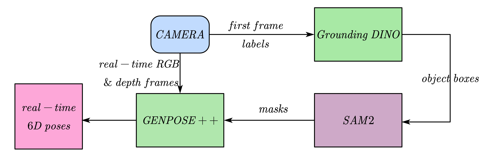

# GenPose2-SAM-2-REAL-TIME 
## Demos 
> Wait 10 seconds for loading demo......
<div align=center>
<p align="center">

</p>
</div>

- The left is real-time 6D poses, and the right is real-time target objects masks(in white)
## Introduction
 
- This project is using only `language labels` to track objects' 6D poses in real time.
- Can be used in **closed-loop robot manipulation**, following [OmniManip](https://omnimanip.github.io/)

## Structure



## ⚙️ Requirements
- Ubuntu 20.04
- Python 3.10.14
- Pytorch 2.1.0
- CUDA 11.8
- 1 * NVIDIA RTX 3080
- Realsense d435i (if your use other RGB-D cameras, remmenber to change the `intrinsics` in `assets/meta.json`

## 🔨 Installation

- ### Create Environment

```bash
conda create -n genpose2 python==3.10.14
conda activate genpose2
```

- ### Install pytorch

``` bash
conda install cudatoolkit=11
pip install torch==2.1.0 torchvision==0.16.0 torchaudio==2.1.0 --index-url https://download.pytorch.org/whl/cu118
```

###  Install GENPOSE2 (do install first) and download checkpoints

follow [GENPOSE2](https://github.com/Omni6DPose/GenPose2)

### Install SAM2 & Grounding DINO and download checkpoints

follow [Grounded-SAM-2](https://github.com/IDEA-Research/Grounded-SAM-2)


## Reference
- [GENPOSE2](https://github.com/Omni6DPose/GenPose2)
- [Grounded-SAM-2](https://github.com/IDEA-Research/Grounded-SAM-2)
- [segment-anything-2-real-time](https://github.com/Gy920/segment-anything-2-real-time)
- [Streaming-Grounded-SAM-2](https://github.com/patrick-tssn/Streaming-Grounded-SAM-2)

## License
This project is licensed under the Apache License, Version 2.0. See the [LICENSE](LICENSE) file for details.

### Third-Party Dependencies
- [GENPOSE2](https://github.com/Omni6DPose/GenPose2/blob/main/LICENSE) - MIT License
